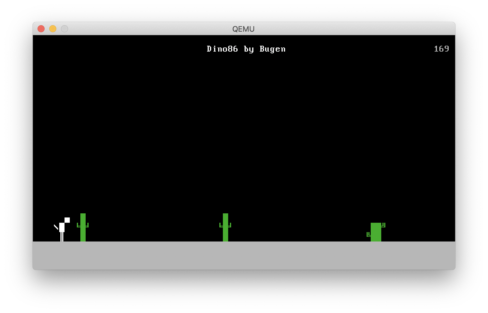
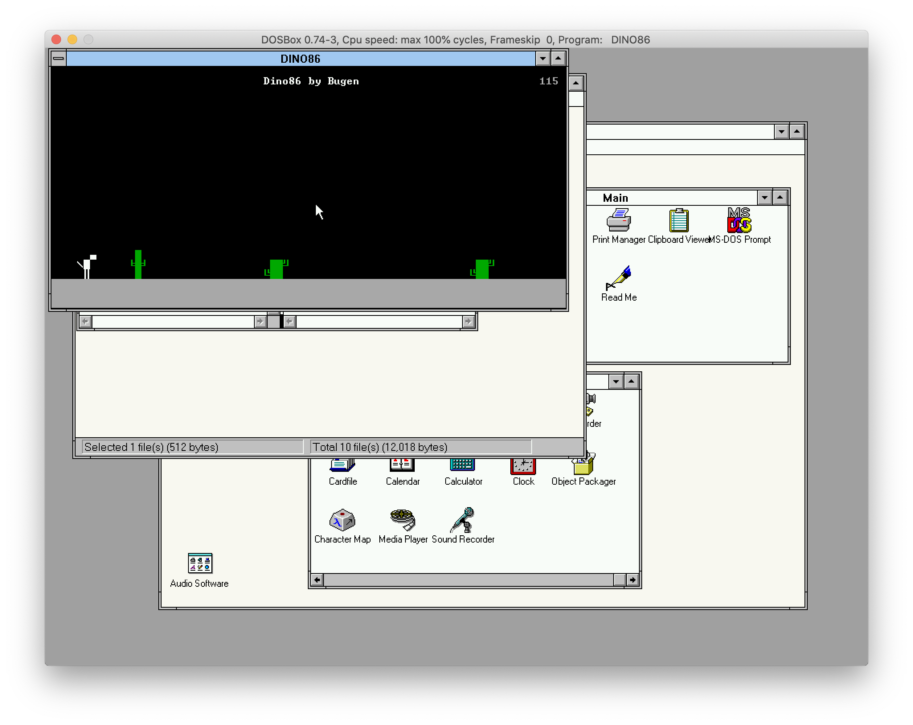
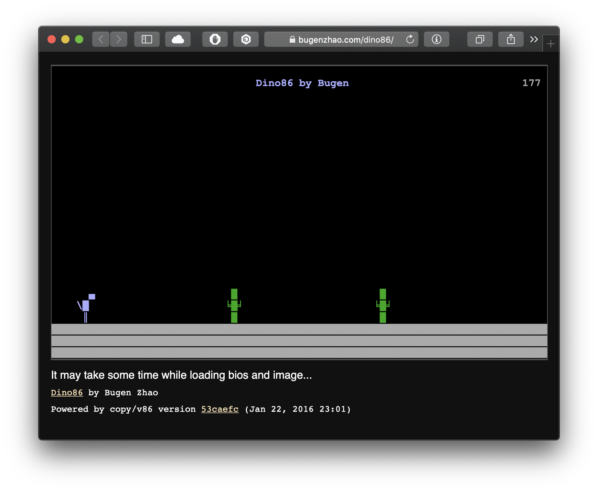

# Dino86
> *All in 510 bytes.*

🦕 A simple copy of Chrome Dino game in **boot sector**, compatible with 8086 / 8088.


- Gaming on boot sector



- Gaming on Windows 3.1 / DOS



- Gaming on an online JavaScript x86 emulator



## Build and Run
- Play online at http://dino.bugenzhao.com ( emulator by [copy/v86](https://github.com/copy/v86) ), or...
- Make sure you have `qemu` and `nasm` installed on your computer. Otherwise,
    - on macOS with Homebrew:
        ```bash
        brew install qemu
        brew install nasm
        ```
    - on Linux with `apt`:
        ```bash
        sudo apt install qemu
        sudo apt install nasm
        ```
- Clone this repository:
    ```bash
    git clone https://github.com/BugenZhao/Dino86.git
    ```
- Build and run directly by executing 
    ```bash
    make run
    ```
- You can also write `dino86.img` to the boot sector of your USB drive / floppy, and play it on a real x86 machine :)

## Bugen Zhao, Apr 2020.
